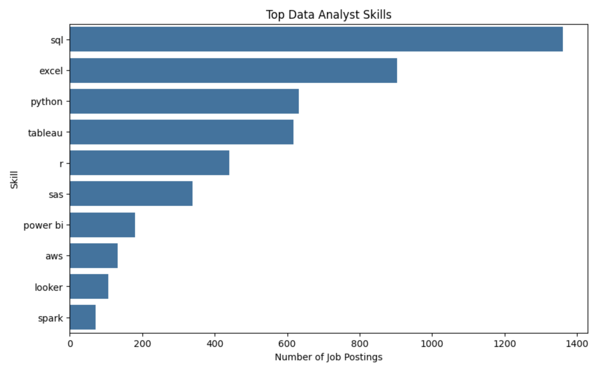
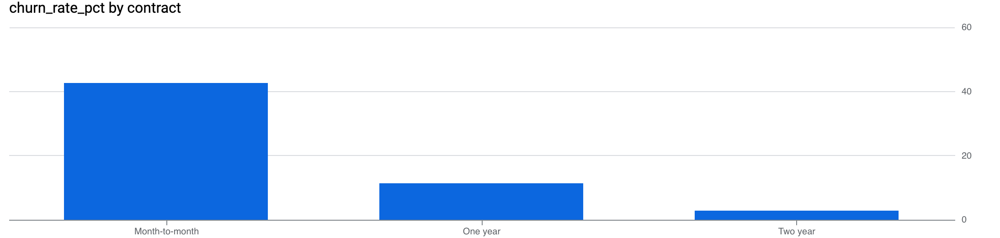

# Gissell Duran — Data Analytics Portfolio

Hi! I'm **Gissell Duran**,

I enjoy using data to uncover insights, improve processes, and support better business decisions. My background in client success allows me to approach data with a **business-first mindset**, focusing on actionable insights that help teams make smarter decisions.

---

## Portfolio Summary

This portfolio demonstrates my ability to:

- Clean and transform raw datasets
- Perform exploratory data analysis (EDA)
- Create data visualizations to communicate insights
- Translate data into meaningful business recommendations

---

## Skills & Tools

**Languages & Data Analysis**
- Python (pandas, numpy, data cleaning, EDA)
- SQL (joins, aggregations, CTEs, window functions)

**Data Visualization**
- Tableau
- Power BI
- matplotlib
- seaborn

**Data Tools**
- Excel (pivot tables, VLOOKUP/XLOOKUP)
- Google Sheets

**Statistics**
- Descriptive statistics
- Hypothesis testing fundamentals

**Business Skills**
- Stakeholder communication
- Process optimization
- Client insights analysis

---

## Featured Projects

---

### Retail Sales Analysis
Explored retail transaction data to uncover customer purchasing behavior, revenue trends, and product performance.

**Tools:** Python, pandas, seaborn, matplotlib  

**Key Highlights:**
- Analyzed customer demographics and spending patterns  
- Identified top-performing product categories  
- Visualized relationships between age, quantity, and revenue  
- Built multiple visualizations to support business insights

🔗 [View Project](retail-sales-analysis/)

---

### Job Market Skills Analysis
Analyzed 2,000+ job postings to identify in-demand skills, salary trends, and hiring patterns for data analyst roles.

**Tools:** Python, pandas, seaborn, matplotlib  

**Key Highlights:**
- Identified SQL, Excel, and Python as the most in-demand skills  
- Analyzed common skill combinations across job postings  
- Examined geographic job distribution across major cities  
- Explored salary trends, showing most roles fall within the $50K–$80K range

🔗 [View Project](job-market-analysis/)

---

### Customer Churn Analysis
Analyzed customer churn data using BigQuery SQL to identify retention patterns and key factors driving customer loss.

**Tools:** SQL (BigQuery)  

**Key Highlights:**
- Identified highest churn among month-to-month customers (~42%)  
- Showed customers without tech support churn significantly more (~41% vs ~15%)  
- Found new customers (0–12 months) have the highest churn (~47%)  
- Highlighted strong retention among long-term customers (49+ months)

🔗 [View Project](customer-churn-analysis/)

---

## Projects Roadmap

Upcoming projects in this portfolio will include:

- Customer Segmentation Analysis
- Sales Dashboard with Tableau / Power BI

---

## Currently Learning

- Advanced SQL queries
- Data storytelling and visualization design
- Dashboard development best practices

---

## Contact

**LinkedIn**  
www.linkedin.com/in/gissellduran  

**Email**  
gissellafanador@gmail.com
