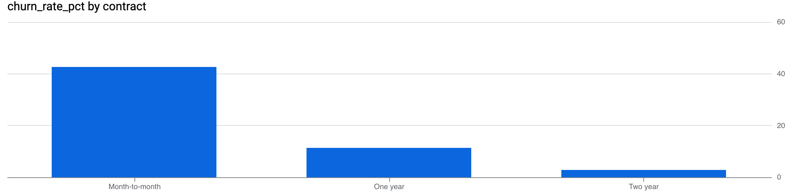
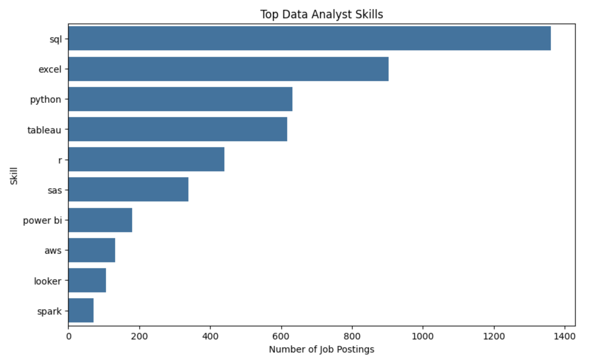

# Gissell Duran – Data Analytics Portfolio

## About Me

I’m currently pursuing a Master’s in Data Science with interests in customer behavior, retention analytics, and business intelligence. My background in psychology and client operations shapes how I approach data storytelling and user behavior analysis.

This portfolio highlights projects in customer analytics, retention analysis, and data-driven decision-making using SQL, Python, and visualization tools.

---

## Projects

### Customer Churn Analysis
Analyzed customer churn data using SQL in BigQuery to identify key drivers of retention and customer attrition.

**Tools:** SQL (BigQuery)

**Key Highlights:**
- Calculated overall churn rate (~26.5%), identifying a significant retention challenge  
- Found that month-to-month customers had the highest churn (~42%), indicating low contract commitment risk  
- Identified ~3x higher churn among customers without tech support (41% vs 15%)  
- Determined new customers (0–12 months) are most at risk (~47% churn), highlighting onboarding gaps  

[View Project](customer-churn-analysis/)

---

### Job Market Skills Analysis
Analyzed 2,000+ data analyst job postings to identify in-demand skills, salary trends, and hiring patterns.

**Tools:** Python, pandas, matplotlib

**Key Highlights:**
- Identified SQL, Excel, and Python as the most in-demand skills across job postings  
- Analyzed common skill combinations to understand employer expectations  
- Examined geographic distribution of roles across major cities  
- Evaluated salary trends, showing most roles fall within the $50K–$80K range  

[View Project](job-market-analysis/)

---

### Retail Sales Analysis
Analyzed retail transaction data to uncover purchasing patterns and key revenue drivers.

**Tools:** Python, pandas, matplotlib

**Key Highlights:**
- Identified clothing as the highest purchase frequency category  
- Found minimal correlation between customer age and purchase amount  
- Analyzed relationship between purchase quantity and total transaction value  

[View Project](retail-sales-analysis/)

---

### A/B Testing An Onboarding Flow To Improve User Activation
Analyzing a new onboarding flow to uncover improvements in user activation and any possible negative impacts on downstream navigation or 7-day retention.

**Tools:** SQL (BigQuery), Python, pandas, matplotlib

**Key Highlights:**

## Project Roadmap

Currently building projects to expand skills in advanced analytics, experimentation, and data storytelling. 

### Customer Segmentation
- Use clustering techniques to group customers based on behavior  
- Identify high-value segments and retention opportunities  

### Dashboard Development
- Build interactive dashboards using Tableau or Power BI  
- Focus on KPI tracking and stakeholder communication  

### Predictive Modeling
- Develop models for classification and forecasting problems  
- Evaluate performance using appropriate metrics  

---

## Technical Skills

**Languages:** SQL, Python, R  
**Data Tools:** BigQuery, Pandas, NumPy  
**Visualization:** Tableau, Power BI, matplotlib  
**Techniques:** EDA, Statistical Analysis, KPI Tracking, Data Cleaning  
**Version Control:** Git/GitHub

---

## Currently Learning
- Advanced SQL window functions
- Predictive modeling with scikit-learn
- Dashboard development in Tableau

---

## Contact

**LinkedIn**  
www.linkedin.com/in/gissellduran  

**Email**  
gissellafanador@gmail.com
