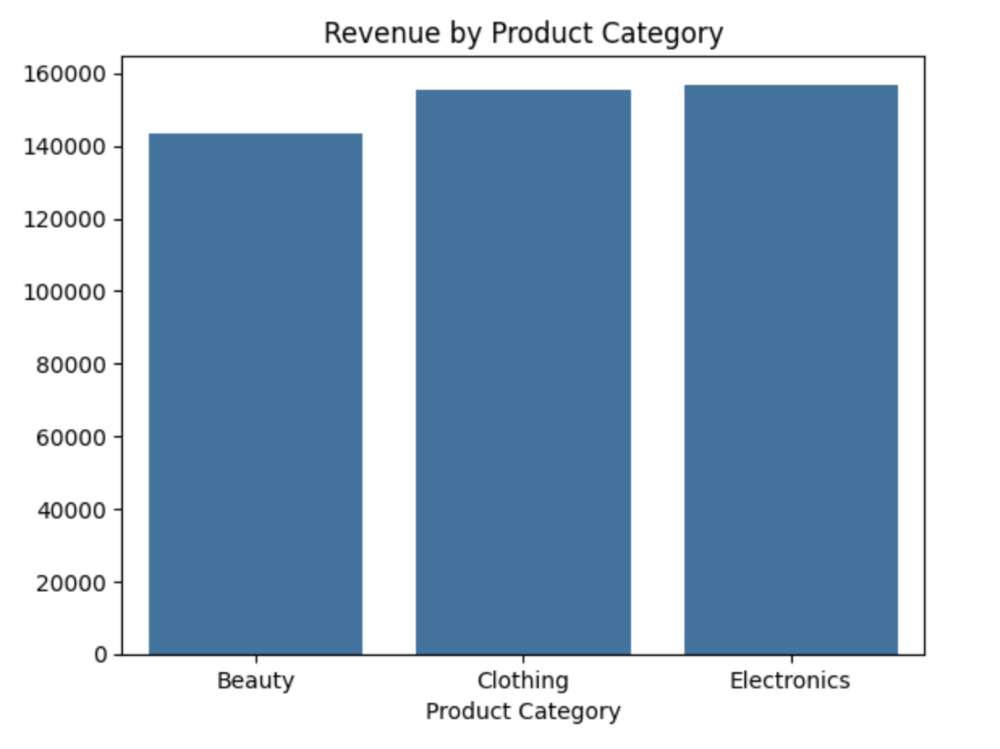
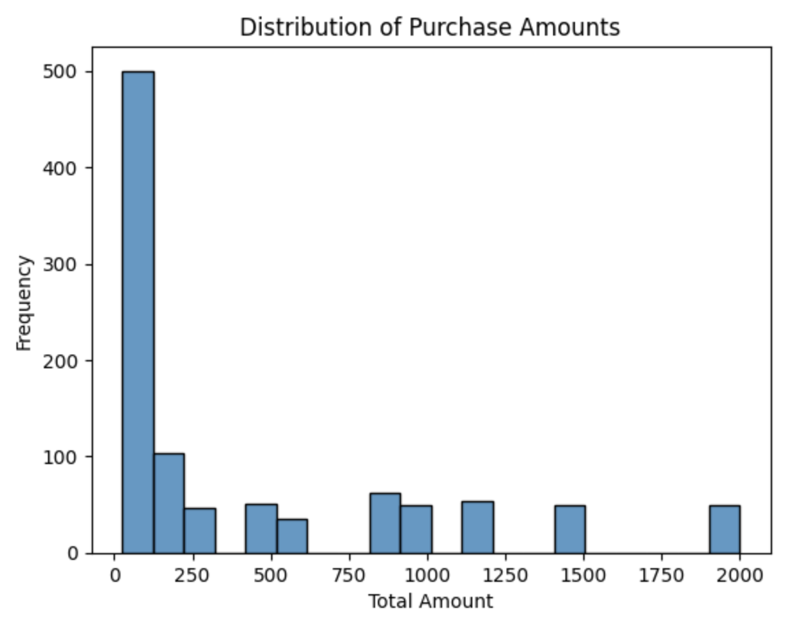
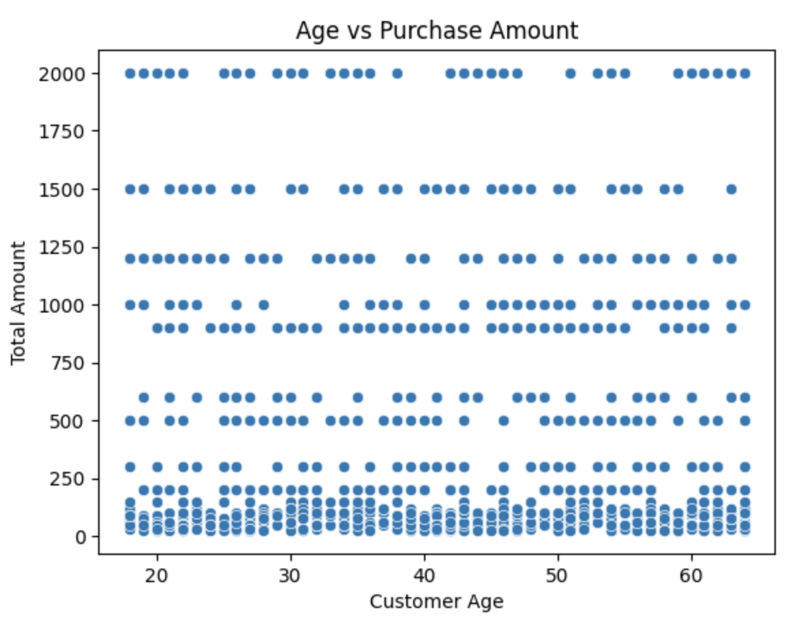
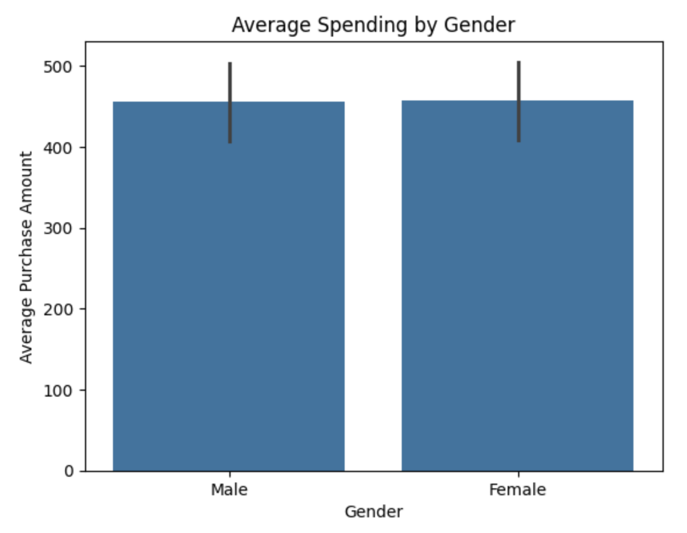
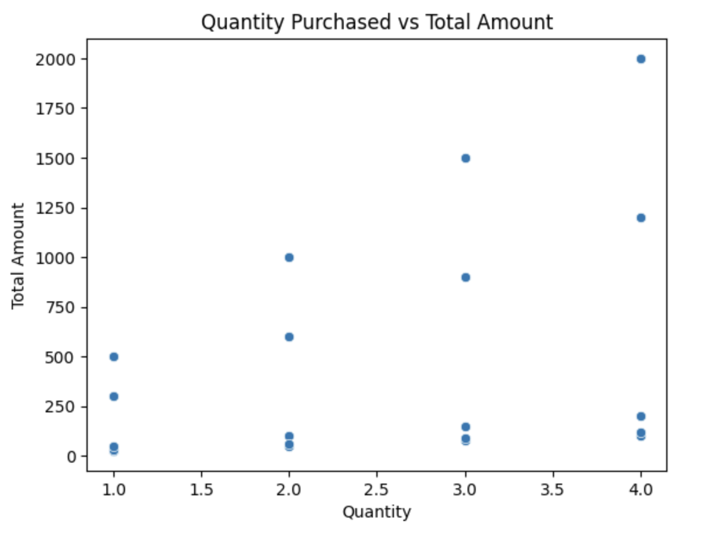
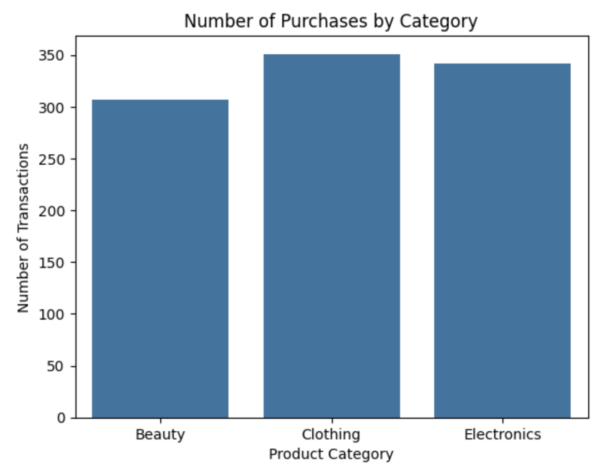

# Retail Sales Data Analysis

## Project Overview
This project analyzes retail transaction data to uncover purchasing patterns and customer behavior.

## Tools
Python, pandas, seaborn, matplotlib

## Analysis Performed
- Data cleaning
- Exploratory data analysis
- Data visualization

## Key Insights
- Clothing had the highest purchase frequency
- Customer age showed little correlation with purchase amount
- Larger purchase quantities resulted in higher transaction values

## Visualizations

### Revenue by Product Category

### Distribution of Purchase Amounts

### Age vs Purchase Amount

### Average Spending by Gender

### Quantity Purchased vs Total Amount

### Number of Purchases by Category

